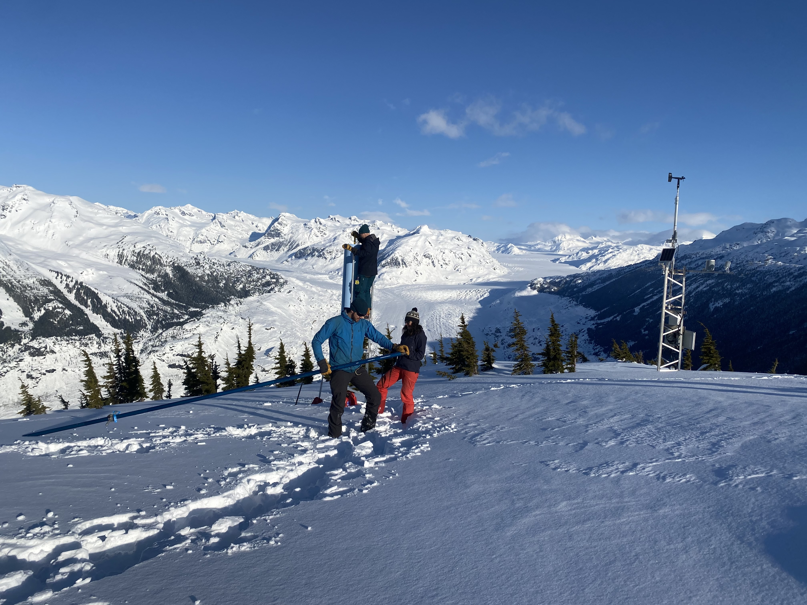

Here's Ali, Griffin and I completing a snow course at the Klinaklina weather station on the central coast. Check out the real-time weather station data for this site [Here](http://graph.viu-hydromet-wx.ca/?_inputs_&preset_site=%22klinaklini%22&custom_site=%22apelake%22&smenu=%22wkly_graph%22). 

